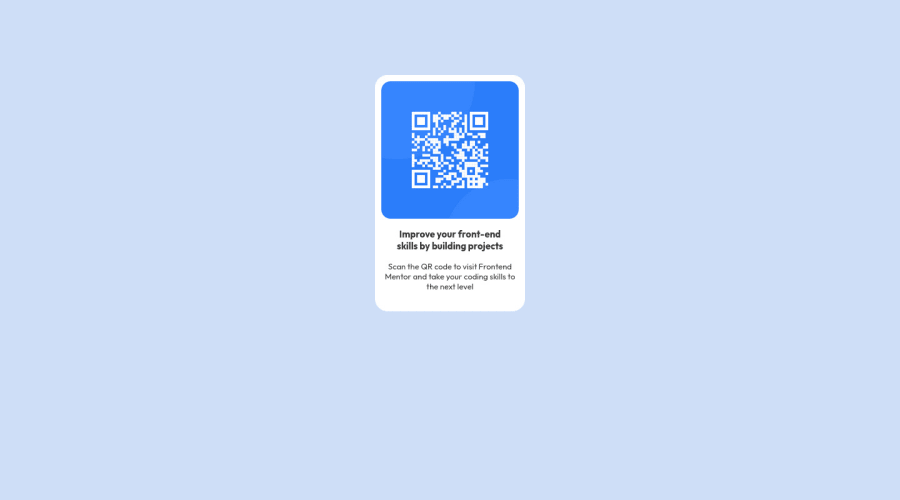

# 📱 QR Code Responsivo

Uma página simples e responsiva que exibe um QR Code centralizado na tela. Projeto desenvolvido com HTML e CSS, ideal para praticar conceitos de layout responsivo e design minimalista.

## Preview



## Funcionalidades

- Layout centralizado e responsivo
- Estilo minimalista e moderno
- Ideal para uso como componente de QR Code em sites ou aplicativos

## Tecnologias usadas

- HTML5
- CSS3

## Aprendizados

Durante o desenvolvimento deste projeto, foram praticados conceitos como:

- Centralização de conteúdo com Flexbox
- Responsividade para diferentes tamanhos de tela
- Uso de unidades relativas (`rem`, `%`) para melhor adaptação em dispositivos móveis
- Boas práticas de estrutura e semântica

## Como rodar

1. Clone o repositório:
   ```bash
   git clone https://lucasdoeni.github.io/QR-Code-Responsivo/
